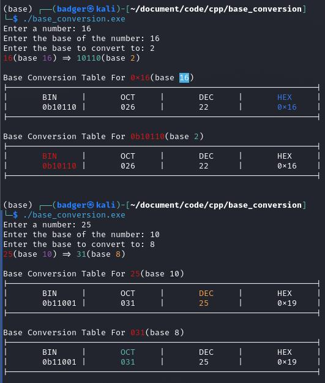

# Base Conversion

## Description

This program converts a number from one base to another. The program takes in a number, the base of the number, and the base to convert to. The program then converts the number to the new base and prints the result in a table.

```diff
- TODO: table formatting messes up w/ big #'s.
	- Use pad text func.
- TODO: center text inside of table.
```
## Example



## Download

```sh
git clone https://github.com/321BadgerCode/base_conversion.git
```

## Usage

> Only works on Linux.
Run `g++ .\base_conversion.cpp` to compile into `.\a.exe` on Windows.
```sh
cd ./base_conversion/
chmod +x ./a.out
./a.out
```